# TechSee AI PR Reviewer - How It Works

## What This System Does

Imagine having an experienced developer on your team who never sleeps, never gets tired, and always follows your coding standards perfectly. That's essentially what the TechSee AI PR Reviewer does for your development workflow.

When someone opens or updates a pull request, this system automatically reviews the code changes using artificial intelligence. It understands your project's specific coding rules (called "Cursor rules") and provides thoughtful feedback just like a human reviewer would - pointing out potential issues, suggesting improvements, and explaining why changes might be needed.

## How the System is Organized

Think of this system like a well-organized team where each member has a specific role:


### The Team Members

**The Project Manager** (`PRReviewer Orchestrator`)
This is the brain of the operation. When a pull request needs reviewing, the project manager coordinates everything - figuring out what rules to apply, which files to review, and making sure all the different parts work together smoothly.

**The Rulebook Keeper** (`Cursor Rules Parser`)
Every project has coding standards, and this component understands all the different ways these rules can be written. Whether your team uses modern `.cursor/rules` files, traditional `.cursorrules`, or `AGENTS.md` documentation, it reads and interprets them all.

**The AI Coordinator** (`AI Provider Factory`)
Since there are many AI services available (OpenAI, Anthropic, Azure, AWS), this component figures out which one to use based on what's available and what works best for your specific review needs.

**The GitHub Communicator** (`GitHub Client`)
This component speaks fluent GitHub - it fetches your pull request details, reads the changed files, and posts comments back to GitHub. It's also polite about not overwhelming GitHub's servers with too many requests at once.

**The Comment Writer** (`Comment Manager`)
This is perhaps the most sophisticated component. It takes the AI's analysis and turns it into helpful, well-formatted comments. It's smart enough to avoid posting duplicate comments and can update existing ones when the code changes.

**The Code Fixer** (`Auto-Fix Manager`)
When the AI spots simple issues that can be automatically fixed (like formatting problems), this component can actually apply those fixes directly to your code.

## The Review Process: A Story

When you create or update a pull request, here's the journey your code goes through:

### Step 1: The Welcome Committee
First, the system wakes up and says "Hey, there's new code to review!" It looks at your pull request and gathers basic information like which files changed, who made the changes, and what the pull request is supposed to do.

### Step 2: Understanding the Rules
Next, it goes hunting for your project's coding rules. It's like checking a style guide before writing a formal letter. The system looks in several places where teams commonly store their coding standards and compiles them into a master rulebook for this review.

### Step 3: The Smart Planning Phase
Here's where it gets interesting. Instead of diving straight into nitpicky details, the AI first takes a step back and creates a "review plan." It reads through all the changes and thinks: "What is this pull request trying to accomplish? What are the key changes? Where should I focus my attention?"

This is like having a senior developer skim through your code first to understand the big picture before doing a detailed review.


### Step 4: The Deep Dive
Armed with the plan, the system now does a thorough review. But it's smart about it - instead of looking at each file in isolation, it reviews files in small groups so the AI can understand how they work together. It's like having someone review a chapter of a book rather than just random sentences.

### Step 5: The Architectural Overview
If enabled, the system also does a "big picture" analysis. It looks across all your changes to spot patterns like:
- "Hey, you're writing very similar code in three different files - maybe this could be refactored?"
- "This business logic seems to be in the wrong place - it might be better in the service layer"
- "These changes create a circular dependency that could cause problems later"

### Step 6: The Polite Conversation
Finally, the system crafts its feedback like a thoughtful code reviewer would. It avoids nagging you about the same issue multiple times, updates its previous comments if you've made changes, and presents everything in a clear, helpful format.

## What Makes This System Special

### It's Flexible About AI Services
The system doesn't lock you into one AI provider. Whether your organization prefers OpenAI, Anthropic's Claude, Azure's services, or AWS Bedrock, it can work with any of them. It even automatically picks the best one available if you don't specify.

### It Learns Your Team's Style
Every development team has their own way of doing things. This system reads your project's coding rules from wherever you keep them - whether that's in modern `.cursor/rules` files, traditional `.cursorrules` files, or even in your `AGENTS.md` documentation.

### It Understands Context
Unlike simpler tools that look at files in isolation, this system understands how your files work together. It reviews code in small batches, so when it's looking at your API controller, it also understands the service layer and data models it interacts with.

### It's Polite and Non-Repetitive
The system uses AI to avoid being annoying. It won't comment on the same issue in multiple places, and if you update your code based on its feedback, it'll update its comments accordingly instead of creating new ones.

### It Can Actually Help Fix Things
For simple, clear-cut issues (like formatting problems or obvious typos), the system can automatically apply fixes to your code. You stay in control - this feature is optional and configurable.

## How Information Flows Through the System

Think of this like a restaurant kitchen where orders (pull requests) come in and go through several stations before the final dish (review comments) is served:

**The Order Comes In**: Your pull request arrives with all its details - what files changed, what the changes look like, and who made them.

**Checking the Recipe Book**: The system looks up your project's coding standards and guidelines, gathering all the rules that apply to the files you've changed.

**The Head Chef's Assessment**: The AI does its initial planning, understanding what you're trying to accomplish and where to focus the review effort.

**The Kitchen Stations**: Different parts of the system work on different aspects - one analyzes the code structure, another checks for style issues, and another looks for potential bugs.

**Quality Control**: Before anything goes out, the system makes sure comments are helpful, not duplicated, and properly formatted.

**Serving the Results**: Finally, you get your feedback in the form of GitHub comments - some right on specific lines of code, others summarizing the overall review.

## When Things Go Wrong (And How We Handle It)

Real-world systems need to handle problems gracefully, and this one is designed with several safety nets:

**If an AI service is down**: The system can automatically switch to a different AI provider, or gracefully skip the review with a helpful message explaining why.

**If the internet is slow**: Built-in delays prevent overwhelming external services, and the system will patiently retry operations that fail due to temporary network issues.

**If there are too many files to review**: The system can intelligently focus on the most important files first, or break large reviews into smaller chunks.

**If something unexpected happens**: Comprehensive logging helps diagnose issues, and the system is designed to provide partial results rather than failing completely.

## Making It Work for Your Team

The system is highly configurable because every team works differently:

**Review Intensity**: You can choose light reviews for quick feedback, standard reviews for balanced analysis, or thorough reviews that catch every detail.

**AI Service Selection**: Use whatever AI provider your organization prefers, or let the system automatically choose the best available option.

**Comment Preferences**: Get just inline comments, just summaries, or both - whatever works for your workflow.

**File Filtering**: Focus reviews on specific file types or directories, and exclude things like generated code or dependencies.

**Auto-fixing**: Decide whether you want simple issues fixed automatically or prefer to review every suggestion manually.

## Privacy and Security

Your code is precious, and this system treats it with appropriate care:

**No Permanent Storage**: Your code is only sent to AI services for analysis and never stored anywhere permanently.

**Secure Communication**: All API communications use encrypted connections and proper authentication.

**Minimal Permissions**: The system only requests the GitHub permissions it actually needs to function.

**Audit Trail**: Every action is logged so you can see exactly what the system did and when.

## Detailed Data Flow

Here's how your code flows through the system, showing the key decision points and processes:

```mermaid
flowchart TD
    A[👨‍💻 Developer Creates/Updates PR] --> B[🚀 GitHub Action Triggered]
    B --> C[⚙️ Load Configuration & Setup]
    C --> D[📋 Find Cursor Rules]
    D --> E[📁 Get PR File Changes]
    
    E --> F[🔍 Filter Files by Patterns]
    F --> G[📦 Create File Batches]
    G --> H[🤖 Choose AI Provider]
    
    H --> I[📋 Step 1: Generate PR Plan]
    I --> J[🏗️ Step 2: Architectural Review]
    J --> K[🔍 Step 3: Detailed File Review]
    
    K --> L[💭 Get Existing Comments]
    L --> M[🧠 AI Deduplication Check]
    M --> N[📍 Map Comment Locations]
    
    N --> O{🔧 Auto-Fix Enabled?}
    O -->|Yes| P[🛠️ Apply Safe Fixes]
    O -->|No| Q[💬 Post Comments]
    P --> Q
    
    Q --> R[📊 Post Summary]
    R --> S[✅ Review Complete]
    
    subgraph "AI Processing"
        T[OpenAI] 
        U[Anthropic]
        V[Azure OpenAI]
        W[AWS Bedrock]
    end
    
    H -.-> T
    H -.-> U  
    H -.-> V
    H -.-> W
    
    style A fill:#e1f5fe
    style S fill:#c8e6c9
    style I fill:#fff3e0
    style J fill:#f3e5f5
    style K fill:#e8f5e8
```



### The Complete Journey Explained

**🚀 Trigger & Setup**
When you create or update a PR, GitHub automatically starts the review process. The system loads its configuration and gets ready to work.

**📋 Rule Discovery**
The system hunts for your coding standards in `.cursor/rules/*.mdc`, `AGENTS.md`, or `.cursorrules` files. It will proceed with the review regardless - using project-specific rules if found, or general best practices if not.

**📁 File Analysis**
It fetches all the changed files from your PR, applies any include/exclude filters you've configured, and organizes them into small batches for better AI analysis.

**🤖 AI Selection**
The system chooses the best available AI provider (OpenAI, Anthropic, Azure, or AWS Bedrock) based on your configuration or automatically detects what's available.

**Three-Phase Review Process:**

- **📋 Phase 1: PR Planning** - The AI reads all your changes to understand the big picture and create a review strategy
- **🏗️ Phase 2: Architectural Review** - Looks across multiple files for design patterns, code duplication, and structural issues  
- **🔍 Phase 3: Detailed Review** - Examines each file batch for specific bugs, style issues, and rule violations

**💭 Smart Comment Management**
The system fetches any existing review comments and uses AI to avoid posting duplicates. It intelligently maps issues to the correct line numbers in your files.

**🔧 Optional Auto-Fixing**
If enabled, the system can automatically apply simple fixes like formatting corrections before posting comments about more complex issues.

**💬 Final Output**
You receive helpful inline comments on specific code lines, plus a comprehensive summary comment with overall statistics and findings.

## Data Transformation Journey

Let me break down exactly what happens to your data as it flows through the system:

### 1. **Input Data Collection**
```
Raw PR Data → Structured PR Context
├── Owner/Repo information
├── PR number and SHA values  
├── Changed files list with patches
└── PR metadata (title, description)
```

### 2. **Rule Processing Pipeline**
```
Raw Rule Files → Processed Rule Objects
├── .cursor/rules/*.mdc → Parsed with metadata
├── AGENTS.md → Plain text rules
├── .cursorrules → Legacy format rules
└── Combined → Filtered by file patterns
```

### 3. **AI Processing Chain**
```
Code + Rules → AI Analysis → Structured Issues
├── PR Planning: Files → Context Understanding → Review Strategy
├── Architectural: Multiple Files → Cross-file Analysis → Design Issues  
└── Detailed: File Batches → Line-by-line Review → Specific Issues
```

### 4. **Comment Intelligence Flow**
```
Raw Issues → Smart Comments → GitHub Posts
├── Deduplication: New Issues + Existing Comments → Filtered Issues
├── Positioning: Diff Lines → Valid File Line Numbers
├── Formatting: Issues → Markdown Comments with Suggestions
└── Management: Comments → Create/Update/Delete Operations
```

### 5. **Output Data Structure**
```
Review Results → Multiple Output Formats
├── Inline Comments: File + Line + Issue + Suggestion
├── Summary Comment: Statistics + Overview + Flow Diagram
├── Architectural Comment: Cross-file Issues + Design Feedback
└── Action Outputs: Metrics for CI/CD Integration
```

## The Bottom Line

This system is like having a tireless, knowledgeable teammate who's always ready to provide thoughtful code reviews. It understands your project's standards, speaks fluent GitHub, and provides helpful feedback that actually makes your code better. Best of all, it learns and adapts to how your team works, becoming more valuable over time.
